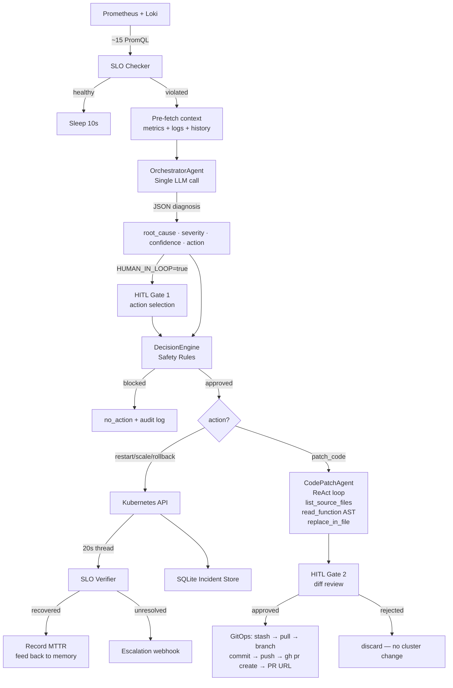
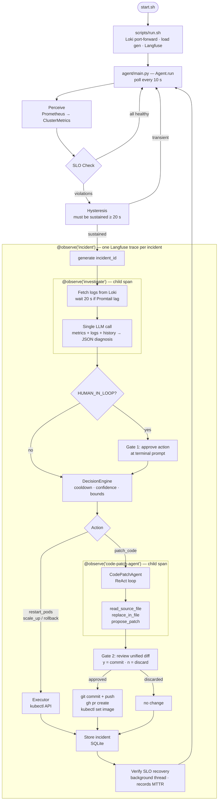

# Agentic DevOps — Self-Healing Kubernetes System

An autonomous SRE agent written in Python that monitors a Kubernetes cluster, detects SLO violations, runs a **single-call LLM diagnosis** to determine root cause, and takes corrective action — including writing and PR-ing code fixes — before verifying recovery. Tracks real MTTR per incident.

The agent closes the full loop: **detect → investigate → HITL → safety-gate → act → verify → remember**.

> **MTTR** (Mean Time To Recovery) — the clock starts the moment an SLO breach is detected, stops when the post-action SLO re-check passes. Stored per incident as a Prometheus histogram (`agent_mttr_seconds`), queryable in Grafana.


**Architecture — Drop 2 (single-call diagnosis + HITL + code patching):**


---

## What It Does

```
Every 10 seconds:

┌──────────────────────────────────────────────────────────────────────────┐
│  1. PERCEIVE    Prometheus (~15 PromQL queries) + Loki logs              │
│  2. SLO CHECK   Skip LLM if all SLOs healthy — no wasted tokens          │
│  3. INVESTIGATE OrchestratorAgent — single LLM call with:               │
│                   - pre-fetched metrics snapshot                         │
│                   - pre-fetched Loki logs (last 2 min, 20s retry)        │
│                   - past incident history from SQLite                    │
│                   → returns JSON: {action, root_cause, severity,         │
│                                    confidence, reasoning}                │
│  4. HITL        Gate 1 — operator approves action (with timeout)         │
│  5. PLAN        DecisionEngine — hard safety gates, cooldown, bounds     │
│  6. ACT         restart_pods / scale_up / rollback / patch_code          │
│                   patch_code: CodePatchAgent (own ReAct loop)           │
│                     Tools: list_source_files, read_function (AST),      │
│                            replace_in_file, propose_patch               │
│                   → HITL Gate 2: diff review before any git ops         │
│                   → GitOps: stash → pull → branch → commit → push       │
│                             → gh pr create → PR URL                     │
│  7. REMEMBER    SQLite incident store + episodic memory                  │
│  8. VERIFY      Re-check SLOs after 20s → record MTTR → feed back       │
└──────────────────────────────────────────────────────────────────────────┘
```



---

## Architecture

| Layer | Package | What it does |
|---|---|---|
| Perception | `perception/` | Polls Prometheus + Loki; builds `ClusterMetrics` snapshot |
| Investigation | `agents/orchestrator.py` | Single LLM call with pre-fetched context; returns structured JSON diagnosis |
| Code Patching | `agents/specialists/code_patch.py` | `CodePatchAgent` — ReAct loop with AST-based tools; generates targeted patches |
| HITL | `hitl/` | Gate 1: action selection. Gate 2: unified diff review before git ops |
| Planning | `planning/` | `DecisionEngine` — cooldown, replica bounds, confidence thresholds, ALLOW_CODE_PATCHES |
| Action | `action/` | Kubernetes API calls + full `patch_code` pipeline |
| Memory | `memory/` | SQLite: incident records + `AgentMemory` (episodic, per-component) |
| Tracing | `tracing/` | OTel spans, decision audit trail, Langfuse integration |
| Metrics | `agentmetrics/` | Agent's own `/metrics` — MTTR, resolution rate, blocked actions |
| Verification | `utils/verifier.py` | Background thread: re-checks SLOs, records MTTR, feeds outcome back |

---

## Agent Flow



---

## Investigation — Single LLM Call

The investigation step is a single structured LLM call with all context pre-fetched. There is no multi-hop tool loop for diagnosis.

```
Why: multi-hop tool-calling loops (5-10 LLM calls per incident) were fragile
with local Ollama models — the model frequently responded with prose instead
of a tool call, collapsing the chain to no_action. A single well-structured
prompt with all context pre-loaded is 10× more reliable.
```

The pre-fetch step collects:
- Current metrics snapshot (error rates, latency, CPU, memory, pod restarts, replicas)
- Loki logs from the last 2 minutes. If Loki returns nothing (Promtail scrape lag is typically 15–30s), the agent waits 20s and retries with a 5-minute window.
- Past incident history from SQLite (last 5 incidents: root cause, action taken, recovered y/n)

The prompt gives the LLM a strict decision tree and asks for a single JSON object:

```json
{
  "action": "patch_code",
  "root_cause": "TypeError in _format_response_metadata() — float + str",
  "severity": "high",
  "confidence": 0.87,
  "reasoning": "TypeError in logs, confirmed 5xx rate at 82%"
}
```

One additional rule fires in code (not in the prompt): if a named Python exception (`ZeroDivisionError`, `IndexError`, etc.) is found in the logs and the chosen action is `patch_code`, confidence is floored at 0.80. This prevents the model from underselling confidence when the stack trace is unambiguous.

---

## Human-in-the-Loop (HITL)

Set `HUMAN_IN_LOOP=true` to activate both gates. Both have `HUMAN_REVIEW_TIMEOUT_SEC` auto-approve.

### Gate 1 — Action Selection (before DecisionEngine)

```
╭─ HITL Review ────────────────────────────────────────────────╮
│ Severity:    HIGH                                             │
│ Root cause:  TypeError in _format_response_metadata()     │
│ Confidence:  82%                                             │
│                                                               │
│ AI recommends: patch_code                                     │
│                                                               │
│ 1) restart_pods    2) scale_up    3) scale_down              │
│ 4) rollback        5) patch_code  6) no_action               │
╰───────────────────────────────────────────────────────────────╯
Choose [1-6] or Enter to accept AI recommendation:
```

Operator can override the AI's recommendation. If they select a different action, the confidence check in `DecisionEngine` is bypassed — the human takes responsibility.

### Gate 2 — Diff Review (patch_code only, before any git ops)

```diff
--- a/main.py
+++ b/main.py
@@ -42,1 +42,1 @@
-    return sum(_latency_samples) / len(_latency_samples)
+    return sum(_latency_samples) / len(_latency_samples) if _latency_samples else 0.0
```

```
Approve patch? [y/n] (auto-approve in 60s):
```

`[y]` → `git stash → pull → branch → commit → push → gh pr create` → PR URL logged  
`[n]` → patch discarded, no cluster changes made

---

## Code Patching Pipeline (`patch_code`)

When infrastructure remediation isn't sufficient, the agent can propose and PR a code fix.

### Why function-level tools instead of full-file reads

Small local LLMs (7B parameters) struggle to process a 500-line file reliably inside a tool-calling loop. Two tools make this tractable:

- **`read_function(file_path, function_name)`** — uses Python's `ast` module to extract exactly one function. A typical Flask handler is ~15 lines. The LLM receives only what it needs.
- **`replace_in_file(file_path, old_code, new_code, description, confidence)`** — accepts a 2–3 line targeted replacement instead of the full file rewrite. Validates syntax via `ast.parse` before accepting; returns `REJECTED: syntax error` and lets the model retry.

```
CodePatchAgent (own ReAct loop, up to 10 steps)

Preferred path (3 tool calls):
  1. list_source_files()
  2. read_source_file("main.py")
     → returns ~15 lines via AST extraction
  3. replace_in_file("main.py", <buggy lines>, <fixed lines>, description, confidence)
     → validates ast.parse() before accepting
     → returns "Fix applied." or "REJECTED: ..."

Fallback path (if replace_in_file rejects):
  1. list_source_files()
  2. read_source_file("main.py")   ← full file, only if needed
  3. propose_patch("main.py", <complete new content>, description, confidence)
     → validates ast.parse() + checks content length ≥ 60% of original
```

### GitOps step

After the patch is accepted and HITL Gate 2 passes:

```
git stash --include-untracked   (clean working tree)
git fetch origin main
git checkout main
git pull --ff-only origin main
git checkout -b agent-fix/<incident_id>
git add buggy-app/main.py
git commit -m "fix: <description>\n\nIncident: ...\nConfidence: ..."
git push origin <branch>
gh pr create --title "fix(main): ..." --body "## Summary\n..."
→ PR URL printed in logs
```

The PR body includes incident metadata, root cause, confidence, and a checklist test plan.

Safety gates on `patch_code`:
- `ALLOW_CODE_PATCHES=false` → hard block, not bypassable by human override
- `PATCH_MIN_CONFIDENCE` (default 0.75) → soft block, bypassed if human explicitly selected `patch_code`

### Programmatic bug injection

The demo bug is a real code defect in `buggy-app/main.py`: `_format_response_metadata()` concatenates a `float` with `str` using `+` instead of an f-string, raising `TypeError` on every `/api/data` request.

Activate it two ways:
```bash
curl -X POST http://localhost:30080/fault/type_bug   # HTTP endpoint
# or set TYPE_BUG_ACTIVE=1 in the app's environment
```

---

## SLOs Enforced

| Metric | Threshold | Typical response |
|---|---|---|
| 5xx error rate | < 1% | `restart_pods` or `patch_code` |
| 4xx error rate | < 5% | `rollback` or `restart_pods` |
| P99 latency | < 200ms | `restart_pods` or `scale_up` |
| CPU usage | < 80% | `scale_up` |
| CPU throttle | < 25% | `scale_up` |
| Memory usage | < 60% | `restart_pods` |
| OOM kills | = 0 | `restart_pods` |
| Active requests | ≤ 50 | `scale_up` |

---

## Safety Constraints

Every action passes through `DecisionEngine` before execution. The LLM never calls Kubernetes directly.

| Guard | Rule | Bypassable? |
|---|---|---|
| Code patch enable | `ALLOW_CODE_PATCHES` must be `true` | No — hard gate |
| Cooldown | Same action can't repeat within 30s | No |
| Replica upper bound | Will not scale above `MAX_REPLICAS` (default 6) | No |
| Replica lower bound | Will not scale below `MIN_REPLICAS` (default 1) | No |
| Severity gate | Scale-down blocked during `critical`/`high` incidents | No |
| Rollback confidence | Requires ≥ 70% LLM confidence | Yes — human override |
| Patch confidence | Requires ≥ 75% LLM confidence | Yes — human override |

---

## Observability — Four Layers

### 1. Structured Colored Logging

```
10:23:45  INFO      orchestrator         investigation started — 2 violations: ERROR_RATE_BREACH; LATENCY_P99_BREACH
                                         incident_id=run-1778297  violations=2
10:23:46  INFO      orchestrator         invoking LLM for diagnosis — model=qwen2.5:7b
10:23:52  INFO      orchestrator         diagnosis ready — HIGH | patch_code | confidence=87% | TypeError in _format_response_metadata()
```

Per-component accent colors, two-line format (bold message + detail fields), OTel trace ID on every line.

### 2. OpenTelemetry → Jaeger

Distributed tracing across every component. Spans for each agent step, LLM call, tool execution.

```bash
docker run -p 16686:16686 -p 4317:4317 jaegertracing/all-in-one
# set OTLP_ENDPOINT=localhost:4317 in .env
# open http://localhost:16686
```

### 3. Decision Audit Trail (SQLite)

Tracks reasoning quality at each step — what was decided and whether it was correct.

```python
from tracing.decisions import show_chain
show_chain("run-17431234567")
# slo_check → orchestrator → decision_engine → executor → verifier
```

### 4. Langfuse (LLM call tracing)

One trace per investigation. Token counts, latency, inputs/outputs visible per call.

```bash
docker compose -f docker-compose.langfuse.yml up -d
# open http://localhost:3000 → create project → paste keys into .env
# set LANGFUSE_ENABLED=true
```

---

## Stack

| Component | Technology |
|---|---|
| Cluster | [kind](https://kind.sigs.k8s.io/) — local 3-node Kubernetes |
| Agent | Python 3.12, `langchain-core`, `kubernetes`, `prometheus-client` |
| LLM | Ollama (`qwen2.5:7b`) or Claude API (`claude-sonnet-4-6`) |
| Diagnosis | Single structured LLM call with pre-fetched context |
| Code patching | `CodePatchAgent` (ReAct) + AST-based tools + `GitOps` (`gh` CLI) |
| Distributed tracing | OpenTelemetry SDK → OTLP → Jaeger |
| LLM tracing | Langfuse (self-hosted) |
| Decision audit | Custom SQLite-backed decision log |
| Observability | Prometheus + Loki + Grafana (Helm) |
| Target app | Python Flask with fault-injection endpoints + real code bugs |
| CI | GitHub Actions — lint, test, Docker build |

---

## Quick Start

**Prerequisites:** Docker Desktop, `kind`, `kubectl`, `helm`, `gh` CLI, Python 3.12+

### 1 — First-time cluster setup

```bash
./scripts/install.sh
```

Creates a 3-node kind cluster, installs Prometheus/Loki/Grafana via Helm, builds and loads `buggy-app`.

### 2 — Configure

```bash
cd agent
cp .env.example .env
# Edit .env — set LLM_BACKEND, API key, ALLOW_CODE_PATCHES
```

Minimum config:
```bash
LLM_BACKEND=ollama
OLLAMA_MODEL=qwen2.5:7b
# or:
LLM_BACKEND=claude
# ANTHROPIC_API_KEY set in your shell environment
```

### 3 — Start the agent

```bash
./scripts/run.sh
```

Starts port-forwards, load generator, and the agent. All in one command.

### 4 — Inject a fault

```bash
# Infrastructure faults (scale/restart/rollback)
curl -X POST http://localhost:30080/fault/errors   # high 5xx rate
curl -X POST http://localhost:30080/fault/cpu      # CPU spike
curl -X POST http://localhost:30080/fault/memory   # memory leak
curl -X POST http://localhost:30080/fault/latency  # high latency

# Code-level bug (triggers patch_code demo)
curl -X POST http://localhost:30080/fault/type_bug  # TypeError on every request

# Reset
curl -X POST http://localhost:30080/fault/reset
```

### 5 — Full patch_code HITL demo

```bash
./scripts/run.sh --demo-patch
```

Injects the `type_bug` fault 45s after startup. When the SLO breaches:
1. Agent collects metrics + logs + history, makes one LLM call, identifies `TypeError` in `_format_response_metadata()`
2. **Gate 1**: choose `patch_code` at the terminal prompt
3. `CodePatchAgent` calls `read_source_file()` to read the buggy function, calls `replace_in_file()` with the fix
4. **Gate 2**: unified diff shown — type `y` to commit and open a PR
5. `gh pr create` fires → PR URL printed in logs

### 6 — Dashboards

```
Grafana:    http://localhost:30300   admin / admin123
Prometheus: http://localhost:30090
App:        http://localhost:30080
Langfuse:   http://localhost:3000   (after docker compose up)
Jaeger:     http://localhost:16686  (after docker run jaeger)
```

---

## Configuration Reference

| Variable | Default | Description |
|---|---|---|
| `LLM_BACKEND` | `ollama` | `"claude"` or `"ollama"` |
| `ANTHROPIC_API_KEY` | — | Required when `LLM_BACKEND=claude` |
| `OLLAMA_MODEL` | `qwen2.5:7b` | Local Ollama model name |
| `PROMETHEUS_RATE_WINDOW` | `30s` | PromQL rate window — shorter = faster signal |
| `AGENT_POLL_INTERVAL_SEC` | `10` | How often to check SLOs |
| `VERIFY_DELAY_SEC` | `20` | Seconds before post-action SLO re-check |
| `COOLDOWN_PERIOD_SEC` | `30` | Minimum gap between identical actions |
| `ROLLBACK_MIN_CONFIDENCE` | `0.70` | Min LLM confidence to approve rollback |
| `DRY_RUN` | `false` | Log actions without executing |
| `HUMAN_IN_LOOP` | `false` | Pause at both HITL gates before action |
| `HUMAN_REVIEW_TIMEOUT_SEC` | `60` | Auto-approve after N seconds |
| `ALLOW_CODE_PATCHES` | `false` | Enable `patch_code` action (hard gate) |
| `PATCH_MIN_CONFIDENCE` | `0.75` | Min LLM confidence for `patch_code` |
| `AUTO_DEPLOY_PATCH` | `false` | Build + deploy after PR creation |
| `APP_SOURCE_DIR` | — | Local path to app source for `CodePatchAgent` |
| `LANGFUSE_ENABLED` | `false` | Enable Langfuse LLM tracing |
| `OTLP_ENDPOINT` | — | OTel gRPC endpoint (e.g. `localhost:4317`) |
| `AGENT_METRICS_PORT` | `8080` | Prometheus metrics listen port |

---

## Project Structure

```
.
├── agent/
│   ├── main.py                   ← entry point — 8-step agent loop
│   ├── config.py                 ← all config from env vars
│   ├── logging_setup.py          ← structured colored logs + OTel trace correlation
│   ├── agents/
│   │   ├── orchestrator.py       ← OrchestratorAgent — single LLM call diagnosis
│   │   ├── specialists/
│   │   │   └── code_patch.py     ← CodePatchAgent — ReAct loop with AST tools
│   │   ├── base.py               ← IncidentContext, Finding, Diagnosis dataclasses
│   │   ├── memory.py             ← AgentMemory — SQLite episodic memory
│   │   └── llm.py                ← build_llm() factory (Claude + Ollama)
│   ├── hitl/
│   │   └── review.py             ← Gate 1: action select · Gate 2: diff review
│   ├── perception/
│   │   ├── prometheus.py         ← ~15 PromQL queries → ClusterMetrics
│   │   └── loki.py               ← Loki log queries
│   ├── planning/
│   │   └── decision.py           ← DecisionEngine + safety gates + ActionPlan
│   ├── action/
│   │   ├── executor.py           ← Kubernetes API executor + patch_code orchestration
│   │   ├── git_ops.py            ← git stash/pull/branch/commit/push + gh pr create
│   │   └── build_deploy.py       ← docker build + kind load + kubectl rollout
│   ├── memory/
│   │   └── store.py              ← SQLite incident store
│   ├── tracing/
│   │   ├── setup.py              ← OTel TracerProvider
│   │   ├── spans.py              ← agent_span() context manager
│   │   └── decisions.py          ← DecisionLog — per-incident reasoning audit
│   ├── agentmetrics/             ← agent's own Prometheus metrics
│   └── utils/
│       ├── slo.py                ← check_slos() — pure threshold comparison
│       ├── verifier.py           ← post-action SLO re-check + MTTR recording
│       ├── render.py             ← Rich terminal rendering (tables, panels)
│       └── escalation.py         ← Slack/HTTP escalation webhook
├── buggy-app/
│   └── main.py                   ← Flask app with /fault/* endpoints + code bug
├── k8s/                          ← Kubernetes manifests (agent + app + monitoring)
├── scripts/
│   ├── install.sh                ← one-command cluster setup
│   ├── run.sh                    ← recommended entry point (--demo-patch flag)
│   └── load_gen.sh               ← background HTTP load generator
└── docs/
    ├── architecture.png          ← system diagram (regenerate: python docs/generate_diagram.py)
    └── generate_diagram.py       ← matplotlib diagram source
```
