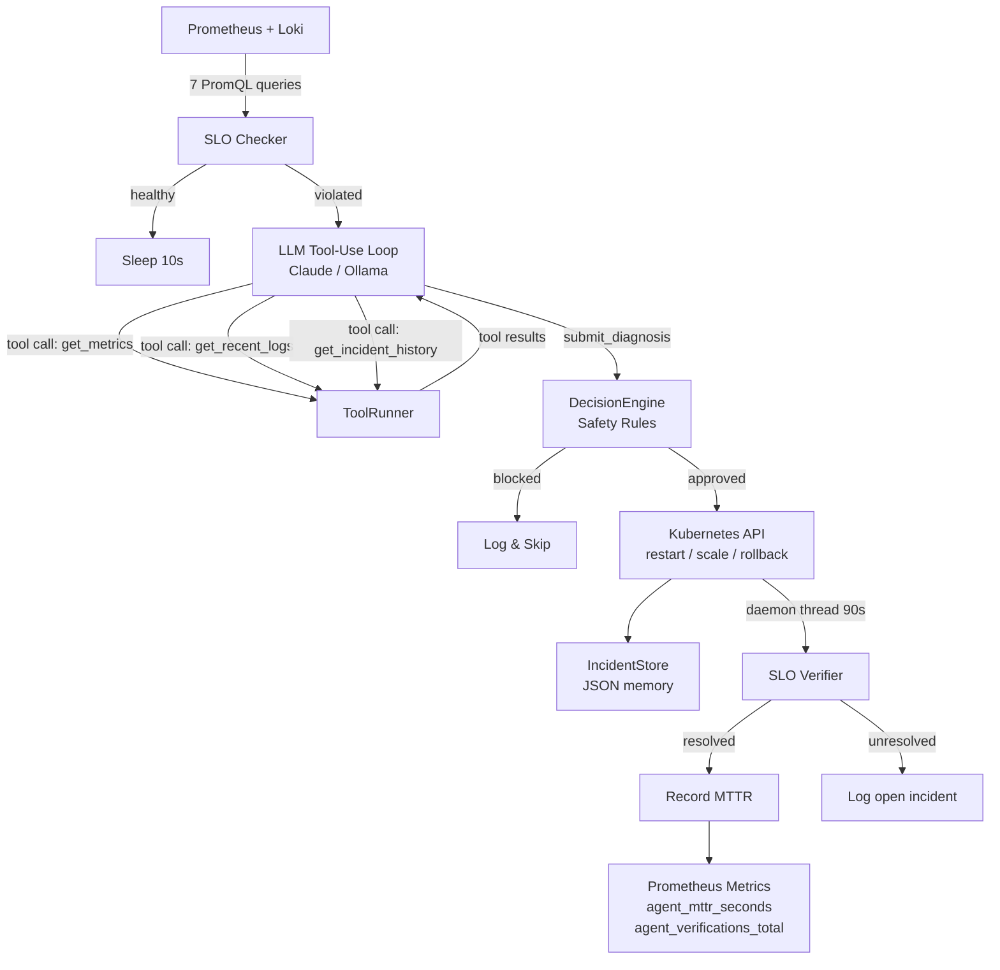

# Agentic DevOps Self-Healing Kubernetes System

An autonomous SRE agent written in Python that monitors a Kubernetes cluster, detects SLO violations, uses an LLM to reason about root cause, takes corrective action, and **verifies the fix worked** — tracking real MTTR and resolution rate.

Unlike [K8sGPT](https://github.com/k8sgpt-ai/k8sgpt) (diagnosis only, no autonomous action) or [kagent](https://github.com/kagent-dev/kagent) (framework only, no complete solution), this agent closes the full loop: **detect → act → verify → measure**.

> **MTTR** (Mean Time To Recovery) — the average time from when an SLO breach is first detected to when all SLOs return to healthy. This agent measures it precisely: the clock starts the moment a violation is detected, and stops when the post-action SLO re-check passes. The result is stored per incident and tracked as a Prometheus histogram (`agent_mttr_seconds`), so you can query p50/p90 MTTR in Grafana and prove the agent is actually healing things — not just taking actions.


---

## How It Works

```
Every 10 seconds:

┌──────────────────────────────────────────────────────────────────────┐
│  1. PERCEIVE   Prometheus (7 metrics, dual-mode PromQL) + Loki       │
│  2. SLO CHECK  Skip LLM if all SLOs healthy (cost savings)           │
│  3. REASON     Multi-turn tool-use loop — LLM calls tools to         │
│                investigate, then submits structured Diagnosis         │
│                  ├─ get_metrics       (ClusterMetrics snapshot)      │
│                  ├─ get_recent_logs   (Loki — only if needed)        │
│                  ├─ get_incident_history (what was tried before)     │
│                  └─ submit_diagnosis  (ends the loop)                │
│  4. PLAN       DecisionEngine applies safety rules                   │
│  5. ACT        Kubernetes API: restart / scale / rollback            │
│  6. REMEMBER   Persist incident to JSON store                        │
│  7. VERIFY     Re-check SLOs after 90s → record MTTR                │
└──────────────────────────────────────────────────────────────────────┘
```



---

## Architecture

| Layer | Package | What it does |
|---|---|---|
| Perception | `perception/` | Polls Prometheus + Loki; builds `ClusterMetrics` snapshot |
| Reasoning | `reasoning/` | Multi-turn tool-use loop — LLM calls `get_metrics`, `get_recent_logs`, `get_incident_history`, then `submit_diagnosis` |
| Planning | `planning/` | `DecisionEngine` enforces cooldown, replica bounds, confidence threshold |
| Action | `action/` | Executes against Kubernetes API via `kubernetes` Python client (no kubectl subprocess) |
| Memory | `memory/` | Persists `Incident` records with outcome verification results |
| Metrics | `agentmetrics/` | Exposes `/metrics` endpoint — the agent monitors itself |
| Verification | `utils/verifier.py` | Daemon thread: re-checks SLOs 90s post-action, records MTTR |

---

## LLM Tool-Use Loop

Instead of a single prompt that hands all data to the LLM upfront, the agent runs a **multi-turn tool-use loop**. The LLM drives its own investigation:

```
User:      "SLO violations detected: CPU_BREACH 91% > 80%, latency P99 340ms > 200ms.
            Investigate and diagnose."

LLM →      tool_call: get_metrics
ToolRunner → { cpu_usage: 0.91, latency_p99_ms: 340, slo_cpu: 0.80, ... }

LLM →      tool_call: get_recent_logs
ToolRunner → "ERROR request failed reason=fault_injection\nERROR ..."

LLM →      tool_call: get_incident_history
ToolRunner → [{ action: "scale_up", slo_recovered: true, mttr_sec: 87 }, ...]

LLM →      tool_call: submit_diagnosis
           { root_cause: "CPU saturation from tight compute loop in buggy-app",
             severity: "high", suggested_actions: ["scale_up", "restart_pods"],
             confidence: 0.88 }
```

**Why this matters vs. a single prompt:**
- The LLM skips Loki entirely if the root cause is obvious from metrics — no wasted tokens
- Incident history lets the LLM avoid repeating an action that already failed
- `submit_diagnosis` uses a typed tool schema — no fragile JSON parsing or regex
- Works with Claude (`stop_reason: "tool_use"`) and Ollama (`mistral-nemo`, `llama3.1`, `qwen2.5`)

---

## SLOs Enforced

| Metric | Threshold | Breach triggers |
|---|---|---|
| Error rate | < 1% | `restart_pods` |
| P99 latency | < 200ms | `restart_pods` or `scale_up` |
| CPU usage | < 80% | `scale_up` |
| Memory usage | < 85% | `restart_pods` |
| Pod restarts | ≤ 3 / 5 min | `restart_pods` |
| Ready replicas | = desired | `restart_pods` |

---

## Safety Constraints

The agent never acts blindly. Every action passes through the `DecisionEngine`:

| Guard | Rule |
|---|---|
| Cooldown | Same action cannot repeat within 120s |
| Replica bounds | Will not scale below 1 or above 6 |
| Severity gate | Scale-down blocked during `critical`/`high` incidents |
| Confidence check | Rollback requires ≥ 60% LLM confidence |

---

## Agent Self-Observability

The agent exposes its own `Prometheus` metrics at `:8080/metrics`:

| Metric | Description |
|---|---|
| `agent_cycles_total` | Total polling cycles |
| `agent_slo_checks_total{result}` | Healthy vs violated cycles |
| `agent_incidents_total{severity}` | Incidents by LLM-assessed severity |
| `agent_actions_executed_total{action}` | Actions dispatched |
| `agent_actions_blocked_total{action,reason}` | Safety layer activity |
| `agent_verifications_total{action,result}` | Did the fix work? |
| `agent_mttr_seconds` | Histogram: time from breach to SLO recovery |
| `agent_llm_calls_total{backend,result}` | LLM call success/error rate |
| `agent_llm_latency_seconds{backend}` | LLM call latency histogram |

Import `dashboards/agent-dashboard.json` into Grafana to see resolution rate, MTTR, and the safety layer in real time.

---

## Stack

| Component | Technology |
|---|---|
| Cluster | [kind](https://kind.sigs.k8s.io/) — 3-node local Kubernetes |
| Agent | Python 3.12, `kubernetes`, `prometheus-client` |
| LLM | Claude API (`claude-sonnet-4-6`) or Ollama (`mistral`) |
| Observability | Prometheus + Loki + Grafana via Helm |
| Target app | Python Flask server with fault-injection endpoints |
| CI | GitHub Actions — build, vet, test, Docker |

---

## Quick Start

**Prerequisites:** Docker Desktop, `kind`, `kubectl`, `helm`, and an Anthropic API key (or Ollama running locally).

### Step 1 — First-time setup

```bash
./scripts/setup.sh
```

Creates a 3-node kind cluster, installs Prometheus + Loki + Grafana via Helm, and deploys the buggy-app. Run once.

### Step 2 — Start the agent

```bash
cd agent
cp .env.example .env          # first time only
```

Edit `.env` and set your API key:
```
LLM_BACKEND=claude
ANTHROPIC_API_KEY=sk-ant-...
```

Then run:
```bash
python main.py
```

The agent starts polling every 10 seconds. Terminal output shows each phase in colour.

### Step 3 — Break something

In a separate terminal, inject a fault:

```bash
curl -X POST http://localhost:30080/fault/cpu      # CPU spike
curl -X POST http://localhost:30080/fault/errors   # high error rate
curl -X POST http://localhost:30080/fault/memory   # memory leak
curl -X POST http://localhost:30080/fault/reset    # back to healthy
```

The agent detects the SLO breach within one poll cycle, runs the LLM tool-use investigation, takes action, and verifies recovery — all automatically.

### Step 4 — View dashboards

```
Grafana:    http://localhost:30300   (admin / admin123)
Prometheus: http://localhost:30090
App:        http://localhost:30080
```

Import `dashboards/slo-dashboard.json` and `dashboards/agent-dashboard.json` into Grafana to see SLO status and MTTR.

---

## Run Agent Inside the Cluster

```bash
# Build and load image
docker build -t devops-agent:latest agent/
kind load docker-image devops-agent:latest --name devops-agent

# Create secret with API key
kubectl create secret generic agent-secrets \
  --from-literal=anthropic-api-key=$ANTHROPIC_API_KEY \
  -n agent-system

# Deploy
kubectl apply -f k8s/agent/rbac.yaml
kubectl apply -f k8s/agent/deployment.yaml

# Check
kubectl logs -f deployment/devops-agent -n agent-system
```

The agent runs with a minimal-privilege `ServiceAccount` (only the RBAC verbs it actually needs).

---

## Configuration

All settings via environment variables:

| Variable | Default | Description |
|---|---|---|
| `LLM_BACKEND` | `ollama` | `"claude"` or `"ollama"` |
| `ANTHROPIC_API_KEY` | — | Required when `LLM_BACKEND=claude` |
| `AGENT_POLL_INTERVAL_SEC` | `10` | How often to check SLOs |
| `VERIFY_DELAY_SEC` | `90` | Seconds to wait before post-action SLO check |
| `COOLDOWN_PERIOD_SEC` | `120` | Minimum gap between identical actions |
| `ROLLBACK_MIN_CONFIDENCE` | `0.6` | LLM confidence required to approve rollback |
| `DRY_RUN` | `false` | Log actions without executing |
| `AGENT_METRICS_PORT` | `8080` | Prometheus metrics listen address |

---

## Project Structure

```
.
├── agent/               # Self-healing agent (Python)
│   ├── agentmetrics/       # Agent self-observability (Prometheus)
│   ├── action/             # Kubernetes API actions (`kubernetes` client)
│   ├── config.py           # Environment variable configuration
│   ├── memory/             # Incident store with outcome tracking
│   ├── perception/         # Prometheus + Loki clients
│   ├── planning/           # DecisionEngine — safety rules
│   ├── reasoning/          # LLM client + root cause analyzer
│   └── utils/              # SLO checker + post-action verifier
├── buggy-app/              # Fault-injectable Python Flask server
├── dashboards/             # Grafana dashboard JSON
│   ├── slo-dashboard.json  # Application SLO metrics
│   └── agent-dashboard.json # Agent self-observability
├── k8s/
│   ├── agent/              # Agent Kubernetes manifests + RBAC
│   ├── buggy-app/          # App Deployment, Service, HPA
│   ├── base/               # kind cluster config
│   └── monitoring/         # Helm values for Prometheus + Loki
└── scripts/
    ├── setup.sh            # One-command cluster setup
    └── demo.sh             # Fault injection demo script
```
